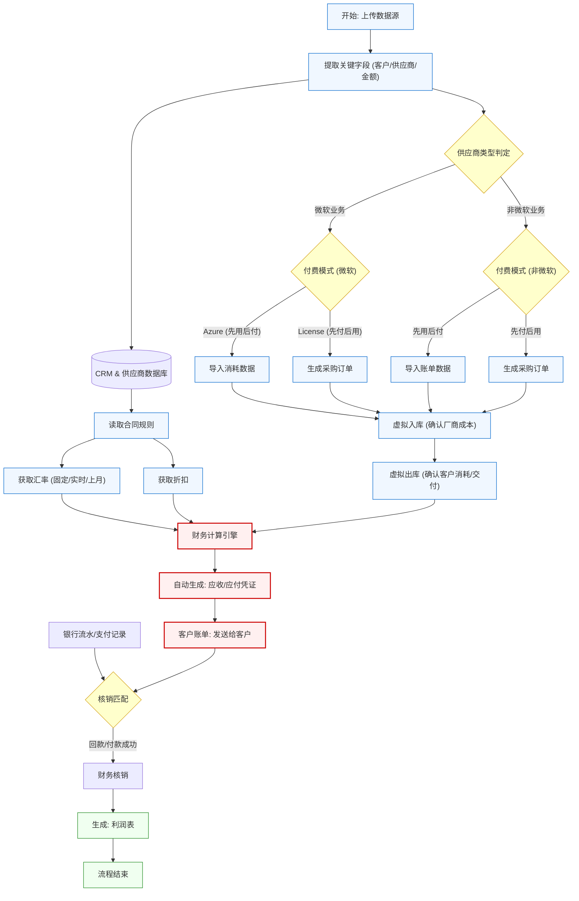

```mermaid
graph TD
    %% --- 1. 基础设置与数据接入 ---
    Start["开始: 上传数据源"] --> Extract["提取关键字段 (客户/供应商/金额)"]
    Extract --> DB[("CRM & 供应商数据库")]
    
    %% 规则加载 (静态)
    DB --> Rules["读取合同规则"]
    Rules --> Rate["获取汇率 (固定/实时/上月)"]
    Rules --> Discount["获取折扣"]
    
    %% --- 2. 业务流转路由 (先判断类型) ---
    Extract --> VendorType{"供应商类型判定"}
    
    %% 分支 A: 微软业务
    VendorType -- "微软业务" --> PayModeMS{"付费模式 (微软)"}
    PayModeMS -- "Azure (先用后付)" --> BizFlowMS_Post["导入消耗数据"]
    PayModeMS -- "License (先付后用)" --> BizFlowMS_Pre["生成采购订单"]
    
    %% 分支 B: 非微软业务
    VendorType -- "非微软业务" --> PayModeOther{"付费模式 (非微软)"}
    PayModeOther -- "先用后付" --> BizFlowOther_Post["导入账单数据"]
    PayModeOther -- "先付后用" --> BizFlowOther_Pre["生成采购订单 "]
    
    %% --- 3. 进销存业务执行 (业务层) ---
    BizFlowMS_Post --> Inbound["虚拟入库 (确认厂商成本)"]
    BizFlowMS_Pre --> Inbound
    BizFlowOther_Post --> Inbound
    BizFlowOther_Pre --> Inbound
    
    Inbound --> Outbound["虚拟出库 (确认客户消耗/交付)"]
    
    %% --- 4. 财务计划与核算生成 (核心修改点：移到此处) ---
    %% 这里体现“业财一体”：业务动作触发财务生成
    Rate --> CalcEngine["财务计算引擎"]
    Discount --> CalcEngine
    Outbound --> CalcEngine
    
    CalcEngine --> GenARAP["自动生成: 应收/应付凭证"]
    
    GenARAP --> AR["客户账单: 发送给客户"]
    
    %% --- 5. 资金结算与核销 ---
    Bank["银行流水/支付记录"] --> Verify{"核销匹配"}
    AR --> Verify

    
    Verify -- "回款/付款成功" --> WriteOff["财务核销"]
    
    WriteOff --> Report["生成: 利润表"]
    Report --> End["流程结束"]

    %% --- 样式定义 ---
    classDef blueNode fill:#f0f7ff,stroke:#0066cc,stroke-width:1px;
    classDef yellowNode fill:#ffffcc,stroke:#d4a017,stroke-width:1px;
    classDef greenNode fill:#f0fff0,stroke:#228b22,stroke-width:1px;
    classDef redNode fill:#fff0f0,stroke:#cc0000,stroke-width:2px;

    class Start,Extract,Rules,Rate,Discount,BizFlowMS_Post,BizFlowMS_Pre,BizFlowOther_Post,BizFlowOther_Pre,Inbound,Outbound blueNode;
    class VendorType,PayModeMS,PayModeOther,Verify yellowNode;
    class Report,End greenNode;
    class CalcEngine,GenARAP,AR,AP redNode;
```